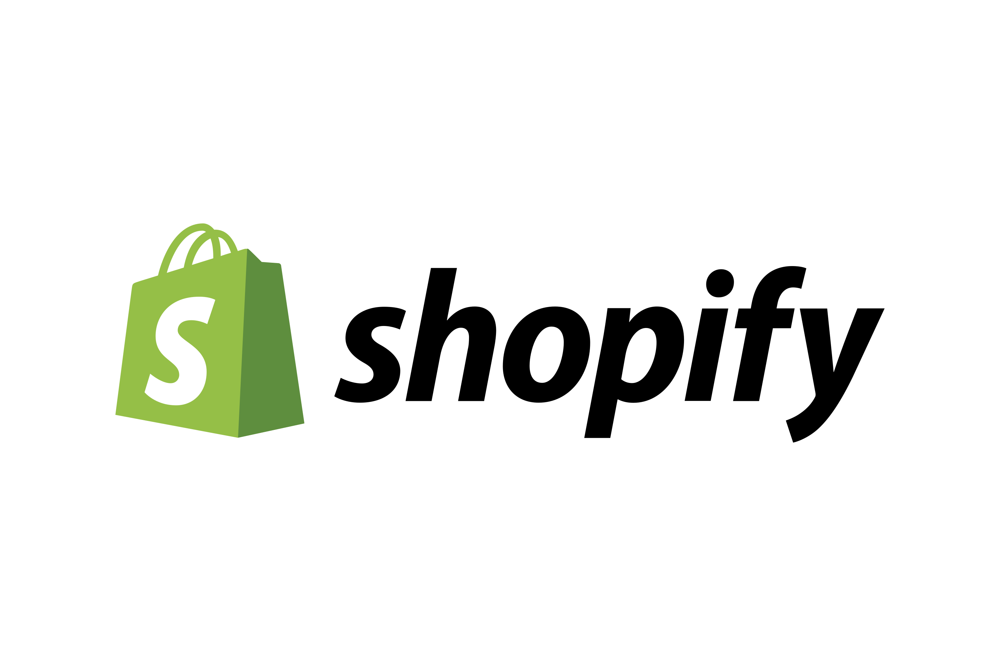
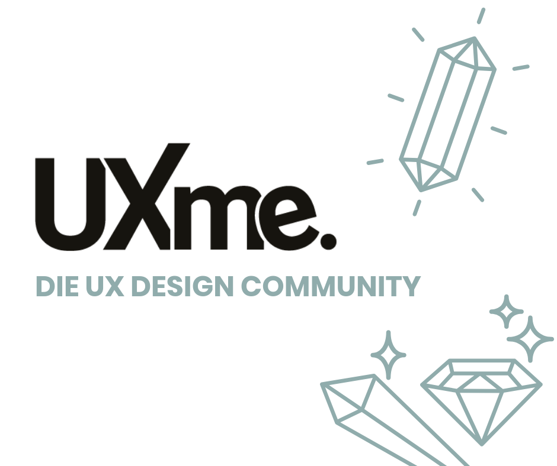
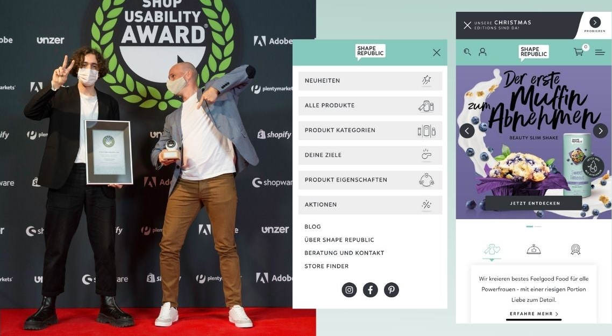

<!DOCTYPE html>
<html lang="en">
    <head>
        <meta charset="UTF-8">
        <meta name="viewport" content="width=device-width, initial-scale=1.0">
        <meta http-equiv="X-UA-Compatible" content="ie=edge">

        <link href="https://fonts.googleapis.com/css?family=Lato:100,300,400,700,900" rel="stylesheet">

        <link rel="stylesheet" href="css/style.css">
        <link rel="shortcut icon" type="image/png" href="img/Asset 1@2x.png">
        
        <title>Portfolio of Jonas Kniel | UX Product Manager at Shape Republic</title>

        
    </head>

    <body>
        

            <input type="checkbox" class="navigation__checkbox" id="navi-toggle">

            <label for="navi-toggle" class="navigation__button">
                &nbsp;
            </label>

            
&nbsp;

            <nav class="navigation__nav">
                <ul class="navigation__list">
                    <li class="navigation__item"><a href="#about-me" class="navigation__link smoothScroll" onclick="uncheck()">01About Me</a></li>
                    <li class="navigation__item"><a href="#in-the-news" class="navigation__link smoothScroll" onclick="uncheck()">02In the News</a></li>
                    <li class="navigation__item"><a href="#case-studies" class="navigation__link smoothScroll" onclick="uncheck()">03Case Studies</a></li>
                    <li class="navigation__item"><a href="#connect" class="navigation__link smoothScroll" onclick="uncheck()">04Connect</a></li>
                    <li class="navigation__item"><a href="https://jonaskniel.wordpress.com/" target="_blank" class="navigation__link smoothScroll" onclick="uncheck()">05My Blog</a></li>
                </ul>
            </nav>
        

        <header class="header">
            

                
            

            

                <h1 class="heading-primary">
                    User Centred working
                    My mission is to drive conversions while delighting users
                </h1>
            

        </header>

        <main>
            <section class="section-about">
                

                    <h2 class="heading-secondary" id="about-me">
                        Hi I'm Jonas 👋🏻
                    </h2>
                

                

                    

                        <h3 class="heading-tertiary u-margin-bottom-small">About me</h3>
                        

                            Mechanical engineer turned product enthusiast with a master focussing on management in tech and design. Since graduating with distinction in 2019 I have been working as a user researcher and product manager. Right now, at Shape Republic I help build an e-commerce experience which has been awarded the Shop Usability award 2020 and featured on Shopify.
                        

                        <h3 class="heading-tertiary u-margin-bottom-small">My values</h3>
                        

                            1. When exploring a new feature/concept trust the <a href="https://softskillsfordesigners.com/wp-content/uploads/2016/07/Screen-Shot-2016-06-28-at-5.48.19-PM-2-1024x444.png" class="btn-text" target="_blank">process</a> and that it will take you through the uncertainty into a productive space. 
                            2. Work towards <a href="https://jonaskniel.wordpress.com/2019/03/05/how-to-lead-for-creative-resonance/" target="_blank" class="btn-text">creative resonance</a> because what you can achieve by collaborating will always be more valuable than what you can acheive by yourself 
                            3. It is better to <a href="https://www.pacific-research.com/wp-content/uploads/2020/09/Iterative-product-development-process.png" class="btn-text" target="_blank">ship earlier & make one more iteration</a> based on user feedback than to perfect in your isolated chamber. 
                        

                    

                    

                        

                            

                                
                            

                        

                    

                

            </section>

            <section class="section-features">
                

                    <h2 class="heading-secondary heading-secondary__white" id="in-the-news">
                        In the News
                    </h2>
                    <h3 class="heading-tertiary heading-tertiary__white ">A selection from blogs and websites featuring my work.</h3>
                

                

                    

                        

                            <a href="https://www.shopify.de/beispiele?category=food-and-drink-templates#ExampleTabWrapper" class="feature-box__link">
                                
                                

                                    

                                        <h3 class="heading-tertiary">Shopify</h3>
                                        04.2021
                                    

                                    

                                        Shape Republic is featured on Shopify as a inspiration source for new customers of what can be built with the Plattform.
                                    

                                

                            </a>
                        

                    

                    

                        

                            <a href="https://uxme.io/interviews/jonas-kniel-von-shape-republic-im-interview-gewinner-beim-shop-usability-award-2020" class="feature-box__link">
                                
                                

                                    

                                        <h3 class="heading-tertiary">UXME</h3>
                                        01.2021
                                    

                                    

                                        Interview with the Design Community UxMe on the Design success of Shape Republic (Text in German)
                                    

                                

                            </a>
                        

                    

                    

                        

                            <a href="https://uxme.io/shops/https-www-shape-republic-com/submissions/1163" class="feature-box__link">
                                
                                

                                    

                                        <h3 class="heading-tertiary">Shop Usability Award</h3>
                                        09.2020
                                    

                                    

                                    Shape Republic is awarded the German Shop Usability Award 2020 in the Category of Food and Drinks.
                                    

                                

                            </a>    
                        

                    

                

            </section>

            <section class="section-tours">
                

                    <h2 class="heading-secondary" id="case-studies">
                        Case Studies
                    </h2>

                    <h3 class="heading-tertiary">Discover my collection of past work and design challenges.</h3>
                    
                

                

                    

                       

                           

                                

                                    &nbsp;
                                

                                <h4 class="card__heading">
                                    Improving a Referral Program
                                </h4>
                                

                                    <ul>
                                        <li>
                                            

                                                
<svg class="icon">
                                                    <use xlink:href="img/sprite.svg#icon-briefcase"></use>
                                                </svg>Company:

                                                
Coya (Insurance)

                                            

                                        </li>
                
                                        <li>
                                            

                                                
<svg class="icon">
                                                    <use xlink:href="img/sprite.svg#icon-clock"></use>
                                                </svg>Timeframe:

                                                
8 Weeks

                                            

                                        </li>

                                        <li>

Strategy

UX-Research

UX-Design

</li>

                                        <li>Lorem ipsum dolor sit amet consectetur adipisicing elit. Neque perferendis quidem dolorem. Quasi voluptatum.</li>
                                    </ul>
                                

                           

                           

                                

                                    <a href="https://spectrum-othnielia-4f8.notion.site/Improving-Coya-s-Referral-Program-df3660b8fea24ce2b41d95f1eebc59f3" target="_blank" class="btn btn--white">To the Case Study</a>
                                

                            

                       

                    

                    

                        

                            

                                

                                    &nbsp;
                                

                                <h4 class="card__heading">
                                    Redesigning a Trial offering
                                </h4>
                                

                                    <ul>
                                        <li>
                                            

                                                
<svg class="icon">
                                                    <use xlink:href="img/sprite.svg#icon-briefcase"></use>
                                                </svg>Company:

                                                
Coya (Insurance)

                                            

                                        </li>
                
                                        <li>
                                            

                                                
<svg class="icon">
                                                    <use xlink:href="img/sprite.svg#icon-clock"></use>
                                                </svg>Timeframe:

                                                
6 Weeks

                                            

                                        </li>

                                        <li>

UX-Research

Facilitation

Strategy

</li>

                                        <li>Lorem ipsum dolor sit amet consectetur adipisicing elit. Neque perferendis quidem dolorem. Quasi voluptatum.</li>
                                    </ul>
                                

                            

                            

                                

                                    <a href="https://spectrum-othnielia-4f8.notion.site/Redesigning-Coya-s-Free-Trial-Offering-7a0887ec3e064412ba4659795e6322d7" target="_blank" class="btn btn--white">To the Case Study</a>
                                

                            

                        

                    

                    

                        

                            

                                

                                    &nbsp;
                                

                                <h4 class="card__heading">
                                    Making Easyjet Futureproof
                                </h4>
                                

                                    <ul>
                                        <li>
                                            

                                                
<svg class="icon">
                                                    <use xlink:href="img/sprite.svg#icon-briefcase"></use>
                                                </svg>Company:

                                                
Easyjet (Case Study)

                                            

                                        </li>
                
                                        <li>
                                            

                                                
<svg class="icon">
                                                    <use xlink:href="img/sprite.svg#icon-clock"></use>
                                                </svg>Timeframe:

                                                
7 Days

                                            

                                        </li>

                                        <li>

Strategy

UX-Research

UX-Design

</li>

                                        <li>Lorem ipsum dolor sit amet consectetur adipisicing elit. Neque perferendis quidem dolorem. Quasi voluptatum.</li>
                                    </ul>
                                

                            

                            

                                

                                    <a href="https://spectrum-othnielia-4f8.notion.site/Personal-Design-Challenge-Making-Easyjet-s-Android-App-Futureproof-a593811c82a043a09b0596b2befdabb8" target="_blank" class="btn btn--white">To the Case Study</a>
                                

                            

                        

                    

                

            </section>

            <section class="section-contact">
                

                    

                        

                            

                                <h2 class="heading-secondary" id="connect">
                                    Let's connect
                                </h2>
                                <h3 class="heading-tertiary">
Reach out to chat about the latest trends in the UX world or grab a bowl of ramen somewhere in Berlin.
</h3>
                            

                        

                        

                            

                                

                                    <svg class="icon__bigger">
                                        <use xlink:href="img/sprite.svg#icon-envelope"></use>
                                    </svg>
                                    <a href="mailto: jonas@kniel.org" class="contact__detail">jonas@kniel.org</a>
                                

                            

                            

                                

                                    <svg class="icon__bigger">
                                        <use xlink:href="img/sprite.svg#icon-phone"></use>
                                    </svg>
                                    <a href="tel: +4915251305339" class="contact__detail">+49 1525 1305339</a>
                                

                            

                            

                                

                                    <svg class="icon__bigger">
                                        <use xlink:href="img/sprite.svg#icon-map-pin"></use>
                                    </svg>
                                    <a href="#" class="contact__detail">10997, Berlin</a>
                                

                            

                            

                                

                                    <svg class="icon__bigger">
                                        <use xlink:href="img/sprite.svg#icon-linkedin"></use>
                                    </svg>
                                    <a href="https://www.linkedin.com/in/jonas-kniel/" target="_blank" class="contact__detail">Jonas Kniel</a>
                                

                            

                            

                                

                            

                            

                                

                                    <svg class="icon__bigger">
                                        <use xlink:href="img/sprite.svg#icon-paperclip"></use>
                                    </svg>
                                    <a href="#" class="contact__detail">Resume</a>
                                

                            

                        

                    

                

            </section>
        </main>

        <footer class="footer">
            

                <picture class="footer__logo">
                    
                </picture>

                
            

            

                

                    

                        <ul class="footer__list">
                            <li class="footer__item"><a href="#about-me" class="btn-text__light smoothScroll">About Me</a></li>
                            <li class="footer__item"><a href="#in-the-news" class="btn-text__light smoothScroll">In the News</a></li>
                            <li class="footer__item"><a href="#case-studies" class="btn-text__light smoothScroll">Case Studies</a></li>
                            <li class="footer__item"><a href="#connect" class="btn-text__light smoothScroll">Connect</a></li>
                            <li class="footer__item"><a href="https://jonaskniel.wordpress.com/" target="_blank" class="btn-text__light smoothScroll">My Blog</a></li>
                        </ul>
                    

                

                

                    

                        Built by <a href="https://www.youtube.com/watch?v=bSfpSOBD30U" class="btn-text__light">Me Myself And I</a>. With love from Berlin.
                    

                

            

        </footer>

        
        
    </body>
</html>
